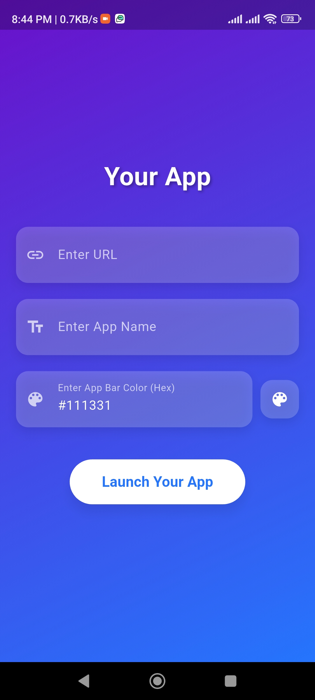
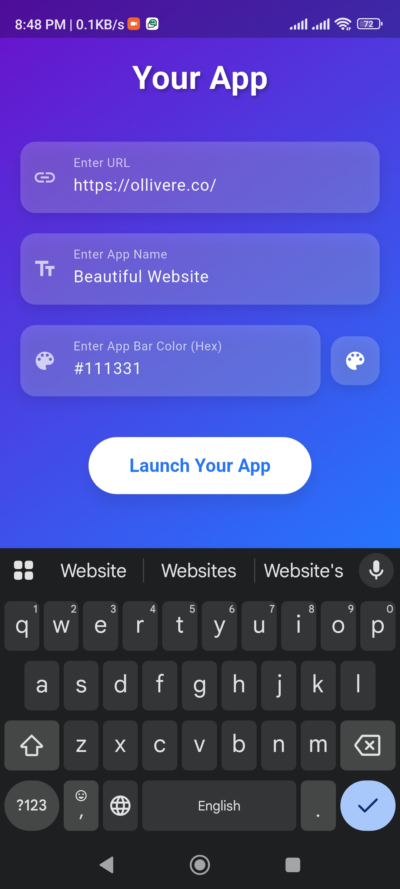

# WebToApp Converter

A Flutter application that transforms websites into mobile apps with customizable features. Simply enter your web address and app name to create a fully functional mobile application.

## Features
- **Instant Web to App Conversion**: Enter any website URL and transform it into a native-looking mobile app.
- **Customizable App Name**: Personalize your app with a custom name.
- **Status Bar Customization**: Change the color and appearance of the status bar to match your brand.
- **Navigation Bar Styling**: Modify the navigation bar color for a seamless user experience using color code hash values.
- **Responsive Design**: Works perfectly across different screen sizes and orientations.
- **Cross-Platform Support**: Compatible with both Android and iOS devices.

## Installation

### Prerequisites
Ensure you have Flutter installed on your machine.

### Clone this repository
```sh
git clone https://github.com/Rian445/web-to-app.git
```

### Navigate to the project directory
```sh
cd webtoapp
```

### Install dependencies
```sh
flutter pub get
```

### Run the app
```sh
flutter run
```

## Usage
1. Launch the app.
2. Enter your desired website URL in the input field.
3. Provide a name for your app.
4. Customize the status bar and navigation bar colors using the color picker.
5. Click "Generate App" to create your web-to-app conversion.
6. Export or share your newly created app.

## Screenshots
Here are some screenshots of the app:




## Requirements
- **Flutter SDK**: 3.0.0 or higher
- **Dart**: 2.17.0 or higher
- **Android**: API 21+ (Android 5.0+)
- **iOS**: 11.0+

## Contributing
Contributions are welcome! Please feel free to submit a Pull Request.

### Steps to contribute:
1. Fork the repository.
2. Create your feature branch:
   ```sh
   git checkout -b feature/amazing-feature
   ```
3. Commit your changes:
   ```sh
   git commit -m 'Add some amazing feature'
   ```
4. Push to the branch:
   ```sh
   git push origin feature/amazing-feature
   ```
5. Open a Pull Request.

---
Feel free to reach out if you have any issues or feature requests!

